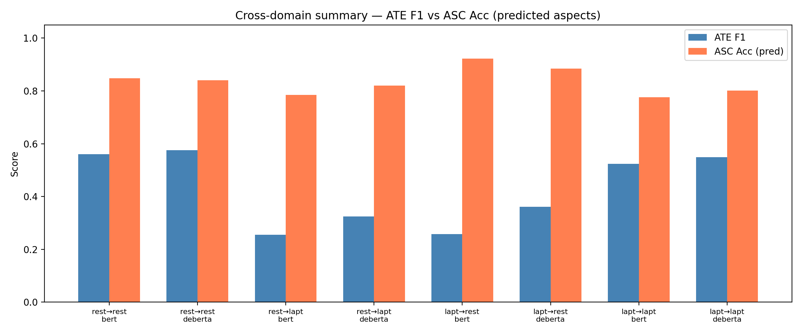
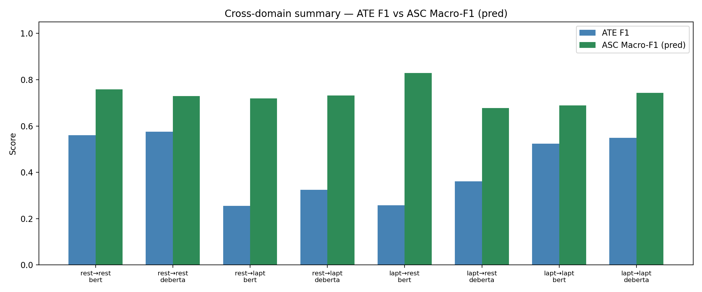
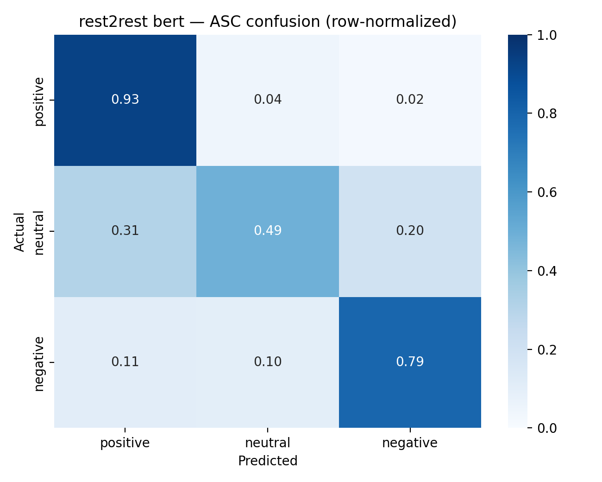
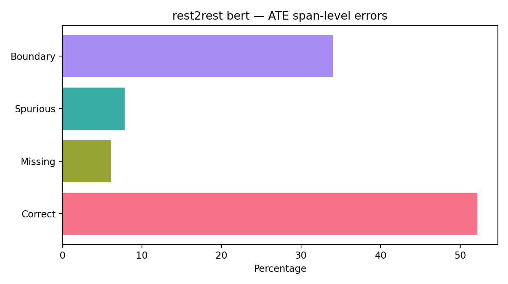
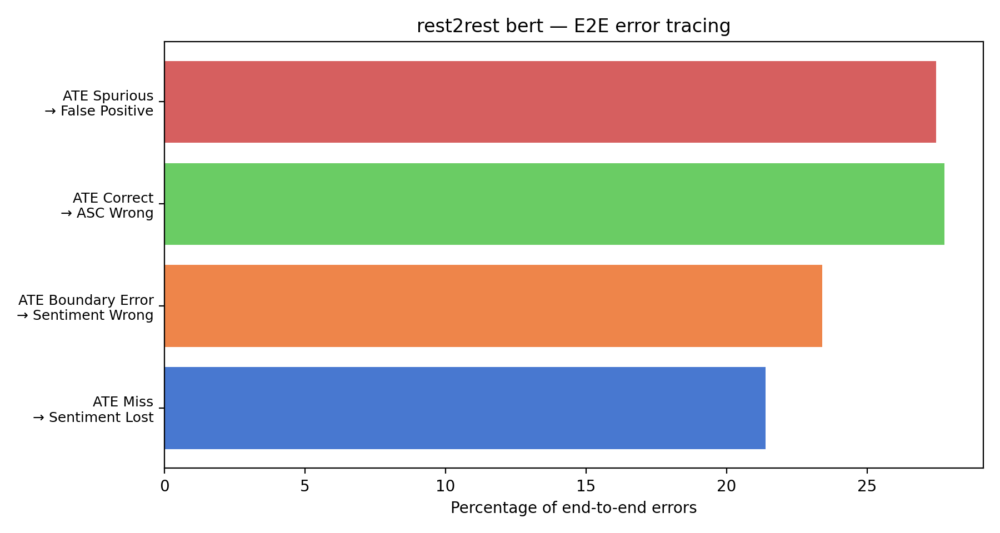
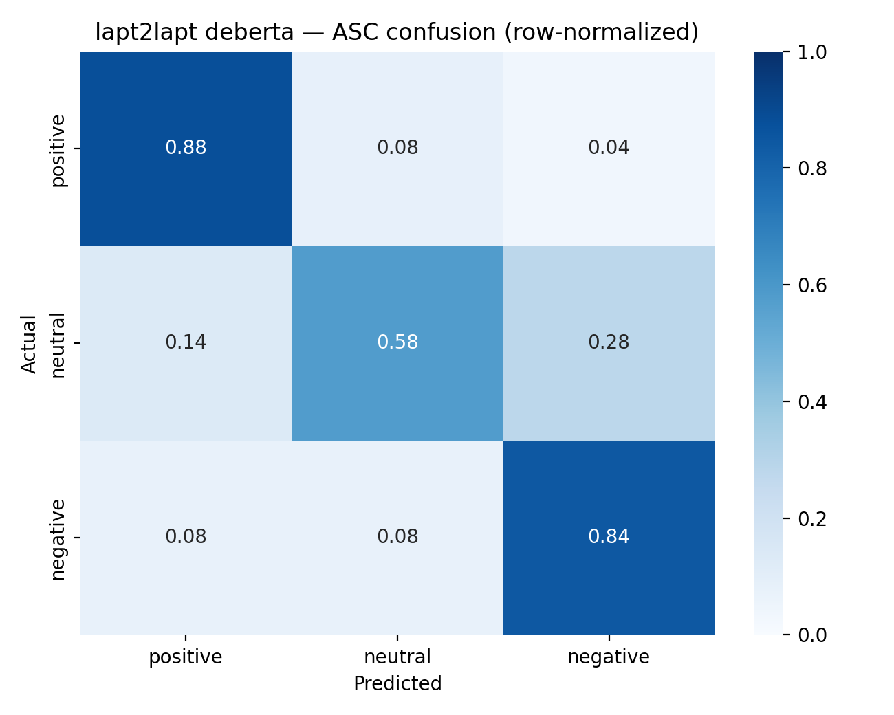
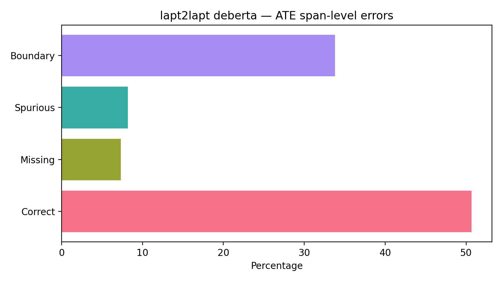
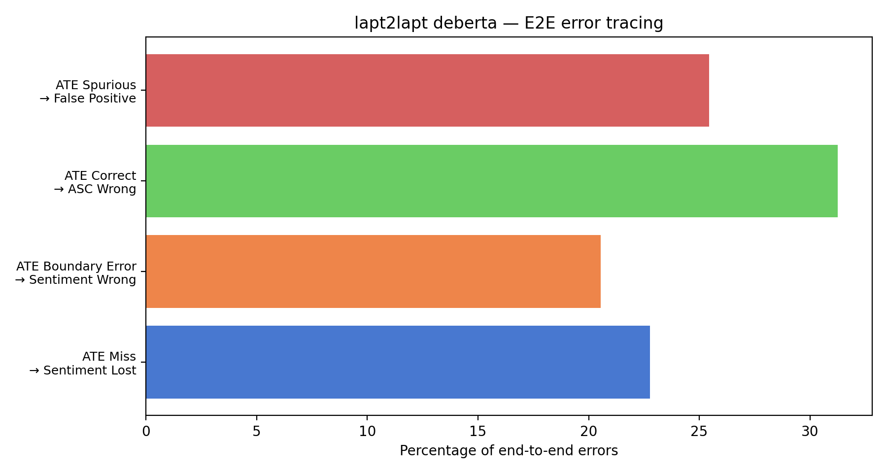
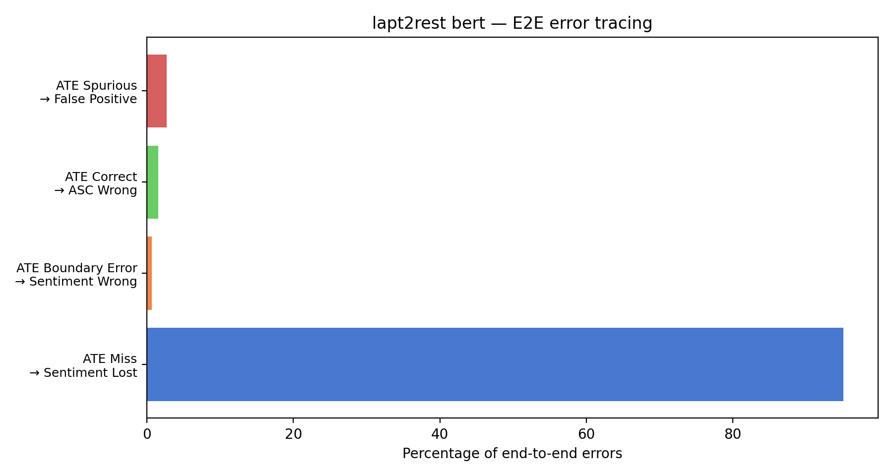
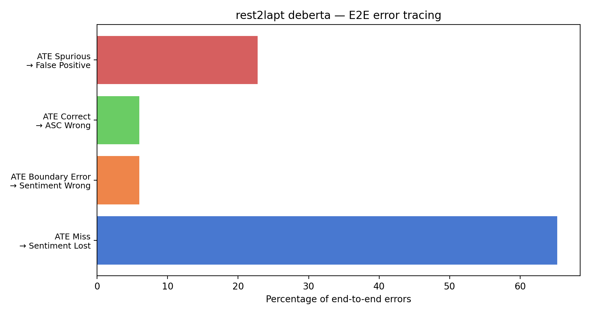

# End-to-End Aspect-Based Sentiment Analysis with Cascaded ATE and ASC on SemEval-2014

**Yubo Wang**  
INFO 7610 — Natural Language Processing (course project)  
Collaborators: Gousu Ding (ATE), Fangyuan Zhang (ASC), Yunzhu Chen (DeBERTa variants)

---

## Abstract

Aspect-based sentiment analysis (ABSA) in real review settings requires both locating opinion targets (aspect terms) and assigning polarity to each target. We study a practical **cascade** in which a span-level **aspect term extraction (ATE)** model feeds an **aspect sentiment classification (ASC)** model that consumes sentence–aspect pairs. Using the SemEval-2014 Task 4 restaurant and laptop benchmarks, we train domain-specific ATE and ASC modules with two encoder backbones—**BERT-base** and **DeBERTa-base**—and evaluate the full pipeline under **in-domain** and **cross-domain** test conditions (eight configurations in total). We report **ATE** precision, recall, and F1, **ASC** accuracy and macro-F1 under **gold** versus **predicted** aspects (the latter reflecting true deployment), and the **error-propagation gap** between the two ASC evaluations. Quantitatively, ATE F1 collapses under domain shift (e.g., from 0.56 in-domain restaurant to 0.25–0.36 on cross-domain tests), while ASC on gold aspects remains relatively stable, indicating that **span extraction** is the dominant bottleneck for end-to-end quality. Surprisingly, ASC accuracy on **predicted** aspects can **exceed** gold-aspect accuracy when the extractor returns a biased subset of “easier” spans; we interpret this pattern as a **selection effect** rather than genuine improvement. Complementing aggregate scores, we analyze **row-normalized confusion matrices**, **ATE span-error distributions**, and **end-to-end error tracing** attributing mistakes to missed aspects, boundary errors, spurious terms, or ASC failures. Materials—including figures and the consolidated metric file `pipeline/outputs/cross_domain_summary.json`—support reproducibility within the project codebase.

---

## 1 Introduction

Online reviews drive decisions in hospitality, retail, and technology markets. Stakeholders rarely need only a single score for an entire document; they need **which aspects** of a product or service were praised or criticized. **Aspect-based sentiment analysis** formalizes this need by linking **targets** (e.g., *battery*, *waitstaff*) to **polarities** (positive, negative, neutral). Industrial pipelines often **decompose** the problem: first detect spans that denote aspects, then classify sentiment **conditioned** on each span. Such modular designs reuse strong sequence taggers and sentence-pair classifiers, simplify debugging, and mirror production constraints where components may be maintained by different teams or updated on different cadences.

Modularity comes with a cost: **errors compound**. An extractor that misses a negative aspect entirely prevents the classifier from ever recovering that signal; an extractor that proposes a slightly wrong boundary may feed the classifier a misleading cue word; spurious aspects generate sentiment labels that do not exist in the annotation. Understanding **where** failures arise is therefore as important as reporting a single end-to-end F1. Prior work on ABSA frequently reports **joint** models or **pipeline** results, but cross-domain studies often emphasize sentiment or domain adaptation **without** isolating the ATE stage’s contribution in a fully wired system.

This work documents an **end-to-end ATE → ASC pipeline** for SemEval-2014 **Restaurant** and **Laptop** domains. We compare **BERT-base-uncased** and **DeBERTa-base** within a common preprocessing and evaluation pipeline, using model-specific hyperparameters while holding data splits consistent across teammates. The experimental matrix covers **eight** settings: for each backbone, we test **in-domain** (train and test on the same domain) and **cross-domain** (train ATE/ASC on one domain, evaluate on the other’s test XML) in both directions. We align evaluation with two ASC regimes: **oracle aspects** (gold spans), which upper-bound sentiment quality absent extraction noise, and **predicted aspects**, which reflect **realistic** pipeline behavior.

Our **contributions** are empirical and diagnostic: (i) a complete **numeric dashboard** for cascade ABSA on standard benchmarks with modern encoders; (ii) explicit **error-propagation** measurement between gold- and predicted-aspect ASC; and (iii) a **structured error analysis**—confusion matrices, span-level ATE error typing, and end-to-end attribution—grounded in exported JSON/JSONL artifacts from the shared codebase. We discuss when **improving ATE** should take priority over **improving ASC**, particularly under domain shift, and when aggregate accuracy can be **misleading** due to extractor-induced selection bias.

**Positioning.** Neural **joint** ABSA systems (span + sentiment in one objective) can implicitly share representations; however, **cascaded** systems remain widespread because they map cleanly to existing tooling, allow **independent** iteration on tagging versus classification, and support **cross-domain** reuse of a sentiment head when only the extractor is retrained. Our study does not claim state-of-the-art joint modeling; instead, it **quantifies cascade behavior** under transparent assumptions that match many engineering roadmaps.

---

## 2 Task and Data

### 2.1 Task definition

We address **two subtasks**:

1. **Aspect term extraction (ATE).** Given a sentence, predict token spans corresponding to explicit aspect mentions. We treat this as a sequence-labeling problem with **BIO** tags over subword tokens and map predictions back to word-level spans for evaluation and for feeding ASC.

2. **Aspect sentiment classification (ASC).** Given a sentence and a **single** aspect string, predict one of **three** labels: **positive**, **negative**, or **neutral**. Following common practice for SemEval-2014, **conflict** labels are excluded from the three-way setup.

The **end-to-end** objective is to output a set of **(aspect, sentiment)** pairs aligned with test-time annotations.

### 2.2 Corpora

We use the **SemEval-2014 Task 4** datasets for **restaurants** and **laptops**: official training XML for model fitting (with a fixed sentence-level train/validation split shared across ATE and ASC preparation scripts) and official **gold test** XML for final evaluation. Restaurant and laptop reviews differ lexically and pragmatically: food discourse involves taste and service vocabulary; laptop discourse emphasizes hardware attributes (*keyboard*, *fan noise*) and performance. These differences motivate **domain-conditioned** models and stress-test **cross-domain** generalization when train and test domains diverge. Both domains use the same **three-way** polarity inventory for ASC, which keeps metrics **comparable** across experiments.

**Preprocessing and splits.** Training examples for ATE and ASC are produced by team scripts that tokenize consistently with the Hugging Face backbones and preserve **aligned** train/validation partitions at the **sentence** level. The **test** partition is always the official SemEval gold file for the target domain. We do **not** perform additional random test splits; all numbers reported here are **comparable** across backbones because they consume the **same** underlying XML for a given experiment ID.

### 2.3 Metrics

**ATE** is scored with span-level **precision, recall, and F1** against gold aspects on the test set. **ASC** is scored with **accuracy** and **macro-averaged F1** over the three classes. For pipeline analysis we compute ASC twice: **ASC (gold)** feeds the classifier **annotated** aspects; **ASC (pred)** feeds it **predicted** aspects from ATE. The **error-propagation gap** is

$$
\Delta_{\text{acc}} = \text{Acc}_{\text{gold}} - \text{Acc}_{\text{pred}}, \quad
\Delta_{\text{F1}} = \text{Macro-F1}_{\text{gold}} - \text{Macro-F1}_{\text{pred}}.
$$

Positive $\Delta$ means predicted aspects **hurt** sentiment relative to oracle spans; **negative** $\Delta$ means predicted aspects **appear easier** than gold—typically when predictions omit difficult aspects or introduce spurious easy-to-classify terms.

**End-to-end pairing.** For each gold aspect, pipeline evaluation checks whether a **matching** predicted aspect (under the project’s span-matching rules) carries the **correct** sentiment. Unmatched gold aspects count against recall; unmatched predicted aspects can create **false positives** if spurious spans receive confident sentiment predictions. This coupling is why **ATE recall** especially influences whether ASC errors are even **measurable** on full gold coverage.

---

## 3 System Description

### 3.1 Overview

The **pipeline** chains independently trained checkpoints. The ATE module emits, for each test sentence, a list of predicted aspect strings (with optional confidence). Each **(sentence, aspect)** string pair is passed to the ASC module, which returns a polarity label. Final **end-to-end** predictions are the union of predicted aspects with their predicted sentiments; evaluation uses standard matching against gold **(aspect, sentiment)** pairs encoded in the SemEval XML.

### 3.2 Models and training

**Backbones** follow `pipeline/config.py`:

- **BERT:** `bert-base-uncased` with **5** training epochs for both ATE and ASC, learning rate **3e-5**, batch size **16** (train) / **32** (eval), weight decay **0.01** where applicable.
- **DeBERTa:** `microsoft/deberta-base` with ATE at batch size **8**, learning rate **2e-5**, **5** epochs; ASC at batch size **16**, learning rate **2e-5**, **3** epochs.

ATE is implemented as token classification; ASC uses a **sentence-pair** encoding **[CLS] sentence [SEP] aspect [SEP]** (implementation details reside in the `ate/` and `asc/` packages). **Domain-specific** weights are trained separately for restaurant and laptop, yielding four ATE checkpoints and four ASC checkpoints per backbone family.

**Why ASC is evaluated twice.** The **gold-aspect** score answers: “How good is sentiment **given perfect targets**?” The **predicted-aspect** score answers: “What does a user actually get **after extraction**?” The gap between them isolates **cascade loss** attributable to span errors. In isolation, a high gold-aspect ASC with low predicted-aspect ASC points to **ATE** as the lever; when both are low, **ASC** may need better features or more data even with clean spans.

### 3.3 Cross-domain protocol

For each backbone, we evaluate **eight** experiments: **(train domain, test domain)** $\in \{\text{restaurant}, \text{laptop}\}^2$, covering **in-domain** baselines and **both** cross-domain directions. ATE and ASC weights always come from the **same training domain**; only the **test XML** changes. This isolates **domain shift** at evaluation time while keeping the training recipe fixed.

### 3.4 Analysis artifacts

Beyond scalar metrics, the pipeline exports **confusion matrices** (absolute counts and **row-normalized** versions), **ATE span-error statistics** (missing, spurious, boundary errors), **end-to-end error-tracing** histograms, and **error example** JSONL files for qualitative inspection. Figures referenced below are copied into this `report/` directory with consistent `figXX_*` filenames.

---

## 4 Experimental Setup

**Table 1** lists the eight experiments (IDs match `pipeline/outputs/cross_domain_summary.json`). All results below come from that consolidated JSON produced by `python -m pipeline.run_cross_domain`.

| ID | Train → Test | Backbone | Type |
|----|----------------|----------|------|
| 1 | restaurant → restaurant | BERT | in-domain |
| 2 | restaurant → restaurant | DeBERTa | in-domain |
| 3 | restaurant → laptop | BERT | cross-domain |
| 4 | restaurant → laptop | DeBERTa | cross-domain |
| 5 | laptop → restaurant | BERT | cross-domain |
| 6 | laptop → restaurant | DeBERTa | cross-domain |
| 7 | laptop → laptop | BERT | in-domain |
| 8 | laptop → laptop | DeBERTa | in-domain |

**Software.** Python **3.10+**, PyTorch with CUDA where available, Hugging Face `transformers` trainers, and project-local dataset builders. **Inference** uses the `final/` exported weights under `ate/ate_output_*` and `asc/asc_output_*` per domain and backbone.

**Hardware and runtime.** Training was performed on NVIDIA GPUs with CUDA **12.x**-compatible PyTorch wheels as pinned by the project lockfile; exact wall-clock times vary by machine. Inference for the eight experiments is **I/O- and model-bound** but feasible to batch overnight on a single consumer GPU because test sets are modest by modern standards.

**Reproducibility.** Provided that the required trained model directories are available, running `python -m pipeline.run_cross_domain` from the repository root regenerates per-experiment folders under `pipeline/outputs/<train_tag>_<model>/`, merges metrics into `cross_domain_summary.json`, and (unless `--skip_figures`) rebuilds plots under `pipeline/figures/`. This report’s tables and figures are **derived from** those artifacts rather than hand-tuned. Figure copies in `report/` are **bitwise duplicates** of selected PNGs under `pipeline/figures/` with filenames normalized for citation.

---

## 5 Results

### 5.1 Aggregate pipeline metrics

**Table 2** reports ATE and ASC metrics and propagation gaps. Values are copied from `cross_domain_summary.json` (numeric literals preserved; trailing zeros omitted in the source where applicable).

| ID | ATE P | ATE R | ATE F1 | ASC Acc (gold) | ASC m-F1 (gold) | ASC Acc (pred) | ASC m-F1 (pred) | Δ Acc | Δ m-F1 |
|----|-------|-------|--------|----------------|-----------------|----------------|-----------------|-------|--------|
| 1 | 0.5558 | 0.5658 | 0.5608 | 0.8304 | 0.7439 | 0.8483 | 0.7589 | −0.0179 | −0.0150 |
| 2 | 0.5691 | 0.5828 | 0.5759 | 0.8420 | 0.7481 | 0.8405 | 0.7288 | 0.0015 | 0.0193 |
| 3 | 0.3244 | 0.2098 | 0.2548 | 0.7618 | 0.7204 | 0.7852 | 0.7192 | −0.0234 | 0.0012 |
| 4 | 0.4116 | 0.2681 | 0.3247 | 0.7947 | 0.7440 | 0.8198 | 0.7320 | −0.0251 | 0.0120 |
| 5 | 0.6605 | 0.1603 | 0.2579 | 0.8018 | 0.6899 | 0.9218 | 0.8283 | −0.1200 | −0.1384 |
| 6 | 0.6228 | 0.2543 | 0.3611 | 0.7982 | 0.67 | 0.8838 | 0.6770 | −0.0856 | −0.0070 |
| 7 | 0.5097 | 0.5379 | 0.5234 | 0.7571 | 0.6971 | 0.7755 | 0.6895 | −0.0184 | 0.0076 |
| 8 | 0.5452 | 0.5521 | 0.5486 | 0.7947 | 0.7547 | 0.8011 | 0.7436 | −0.0064 | 0.0111 |

**Cross-domain ATE collapse.** When training on **restaurant** and testing on **laptop** (IDs 3–4), ATE F1 falls to **0.25–0.32**, far below in-domain restaurant (**0.56–0.58**). The reverse direction (**laptop → restaurant**, IDs 5–6) shows **high precision but very low recall** (e.g., 0.66 precision with **0.16** recall for BERT), yielding low F1 (**0.26–0.36**). These patterns indicate **strong lexical and structural domain gaps** for span identification.

**ASC on gold aspects** remains comparatively **stable** across conditions (accuracy often in the **0.76–0.84** band), suggesting that—with explicit targets—the sentiment model is **not** the primary failure mode under shift in this setup.

**Error-propagation gaps.** Several runs show **negative** $\Delta_{\text{acc}}$: predicted-aspect accuracy **exceeds** gold-aspect accuracy (IDs 1, 3, 4, 5, 6, 7, 8 for accuracy). This arises when the extractor **drops** hard-to-classify aspects or **focuses** on salient sentiment cues, making the predicted subset **easier** than the full gold set. The strongest effect appears for **ID 5** (laptop → restaurant, BERT): gold accuracy **0.8018** versus predicted **0.9218**, with $\Delta_{\text{acc}} = -0.12$. For the same run, predicted-aspect **macro-F1** also exceeds gold (**0.8283** vs. **0.6899**, $\Delta_{\text{m-F1}} = -0.1384$), showing that the selection effect can inflate not only **headline accuracy** but also a **class-balanced** metric.

### 5.2 BERT versus DeBERTa

**In-domain restaurant (1 vs. 2):** DeBERTa improves ATE F1 (**0.5759** vs. **0.5608**) and gold ASC accuracy (**0.842** vs. **0.8304**). For predicted aspects, BERT achieves slightly higher ASC accuracy (**0.8483** vs. **0.8405**) and macro-F1 (**0.7589** vs. **0.7288**), highlighting a **metric-dependent** comparison between gold-aspect and predicted-aspect evaluation.

**In-domain laptop (7 vs. 8):** DeBERTa improves ATE F1 (**0.5486** vs. **0.5234**) and gold ASC metrics. On predicted aspects, DeBERTa leads in accuracy (**0.8011** vs. **0.7755**) and macro-F1 (**0.7436** vs. **0.6895**), with smaller negative accuracy gaps—consistent with **better extraction** reducing harmful mismatch.

**Cross-domain:** DeBERTa’s ATE F1 exceeds BERT’s for **restaurant → laptop** (**0.3247** vs. **0.2548**) and **laptop → restaurant** (**0.3611** vs. **0.2579**), showing **encoder upgrades** help **span ID** under shift, though F1 remains low in absolute terms.

**Interpreting laptop → restaurant (IDs 5–6).** The extractor’s **precision–recall asymmetry** is extreme: many predicted spans are locally plausible (**high precision**) yet **most** gold aspects are missed (**low recall**). For sentiment, evaluating on **predicted** aspects therefore **skips** numerous gold pairs—especially subtle or rare mentions—while ASC may still classify the **surviving** subset with high accuracy. This dynamic explains the **large negative $\Delta_{\text{acc}}$** in ID 5, where predicted-aspect evaluation also yields a higher macro-F1 than gold: the model is **not** universally “better” on predicted inputs; both metrics are inflated by **coverage bias** on an easier surviving subset.

**Interpreting restaurant → laptop (IDs 3–4).** Both backbones suffer low ATE F1, but DeBERTa raises F1 by ~**7** points absolute versus BERT. ASC on gold remains mid-to-high seventies to low eighties in accuracy, reinforcing that **target identification**—not polarity modeling in isolation—is the limiting factor when moving to laptop test vocabulary.

### 5.3 Summary figures

Figure 1 and Figure 2 plot **ATE F1** against **ASC accuracy / macro-F1 on predicted aspects** for all eight experiments, summarizing the **trade-off** between extraction quality and downstream sentiment when aspects are predicted.

---

## 6 Qualitative and Error Analysis

### 6.1 In-domain restaurant (BERT): confusion, ATE errors, and E2E tracing

**Figure 3** shows the **row-normalized** ASC confusion matrix when testing **in-domain** on restaurant data with **BERT**. Each row sums to one; off-diagonal mass in the **neutral** row highlights **neutral→non-neutral** confusion—a recurring issue under **class imbalance** and **implicit** or **hedged** sentiment. Reading this plot alongside Table 2 clarifies why **macro-F1** should accompany accuracy: a classifier that **under-predicts** neutral can still achieve high accuracy while hurting **minority-class** recall.

**Figure 4** breaks down **ATE span-level** errors (missing, spurious, boundary). **Figure 5** attributes **end-to-end** failures to **ATE miss**, **boundary** mistakes, **ASC** errors, or **spurious** aspects. Together, Figures 3–5 give a coherent **in-domain restaurant** portrait before we compare domains.

### 6.2 In-domain laptop (DeBERTa): confusion, ATE errors, and E2E tracing

**Figures 6–8** mirror the same three views for **laptop** test data with **DeBERTa** weights trained on laptop. Neutral–negative–positive confusions differ from restaurant (Figure 6), while ATE error shares (Figure 7) reflect laptop-specific multi-token aspects (e.g., compound product phrases). End-to-end tracing (Figure 8) shows how often **ASC** alone is responsible once spans are correct.

### 6.3 Cross-domain end-to-end tracing

**Figures 9–10** focus on **cross-domain** settings. We categorize mistakes as **ATE miss → sentiment lost**, **ATE boundary error → sentiment wrong**, **ATE correct → ASC wrong**, and **ATE spurious → false positive**. Compared with in-domain Figures 5 and 8, **missed aspects** clearly gain relative mass when the extractor is trained on a **mismatched** domain lexicon, while **boundary** errors do not consistently increase in the two cases shown here.

### 6.4 Example error cases

Exported `error_examples_*.jsonl` files illustrate concrete failure modes. For instance, an **ATE miss** on *people* in “I trust the **people** at Go Sushi…” removes the chance to classify that aspect’s sentiment entirely (**ATE Miss → Sentiment Lost**). A **boundary error** on *sangria* versus *sangria's* can flip polarity when punctuation alters the substring seen by ASC (**ATE Boundary Error → Sentiment Wrong**). **ASC-only** errors include cases where the aspect string is correct but polarity is wrong (e.g., *staff* predicted **positive** where gold is **negative**), motivating **contrastive** or **negation-aware** training even when extraction is perfect.

**Cross-domain qualitative themes (informal).** When ATE trains on restaurant text and tests on laptops, we expect **missed hardware attributes** (*battery*, *keyboard backlight*) and **spurious food-like** tokens if the tagger hallucinates domain-inappropriate spans. In the reverse direction, laptop-trained extractors may **under-segment** multi-word restaurant dish names. We do not manually quantify these patterns here; the **error-tracing** bars and **ATE error-type** histograms provide aggregate proxies, and future work could mine `ate_predictions_*.jsonl` for lexicon-level statistics.

---

## 7 Conclusion

We presented a **cascaded ATE → ASC** system for SemEval-2014 restaurant and laptop reviews with **BERT** and **DeBERTa** backbones, evaluated under **eight** train/test domain configurations. **ATE quality**—especially **recall** under cross-domain test—drops sharply and drives end-to-end risk, while **ASC on gold aspects** stays comparatively stable, indicating **prioritize span extraction** when resources are limited. **Propagation-gap** analysis shows that **accuracy on predicted aspects can exceed gold-aspect accuracy** when extractors **filter** aspects to an easier subset; **macro-F1** and **pair-level** metrics remain essential to avoid overstating sentiment quality. DeBERTa **consistently helps** ATE F1 in cross-domain pairs, but absolute F1 still calls for **domain adaptation**, **data augmentation**, or **joint training**. Future work includes joint modeling, calibrated spurious-mention control, and richer **neutral**-class handling informed by confusion matrices.

---

## References

- Maria Pontiki, Dimitrios Galanis, Haris Papageorgiou, Ion Androutsopoulos, Suresh Manandhar, Mohammad AL-Smadi, Mahmoud Al-Ayyoub, Yanyan Zhao, Bing Qin, Orphée De Clercq, Veronique Hoste, Marianna Apidianaki, Xavier Tannier, Natalia Loukachevitch, Evgeniy Kotelnikov, Nuria Bel, Salud María Jiménez-Zafra, and Gülşen Eryiğit. **SemEval-2014 Task 4: Aspect Based Sentiment Analysis.** SemEval 2014.

- Jacob Devlin, Ming-Wei Chang, Kenton Lee, and Kristina Toutanova. **BERT: Pre-training of Deep Bidirectional Transformers for Language Understanding.** NAACL 2019.

- Pengcheng He, Xiaodong Liu, Jianfeng Gao, and Weizhu Chen. **DeBERTa: Decoding-enhanced BERT with Disentangled Attention.** ICLR 2021.

- Hugging Face model documentation for `bert-base-uncased` and `microsoft/deberta-base` (accessed via the Transformers library used in training).

---

## Appendix: Figure manifest

| File | Description |
|------|-------------|
| `fig01_summary_ate_vs_asc_acc.png` | Summary bar chart: ATE F1 vs ASC accuracy (pred). |
| `fig02_summary_ate_vs_asc_f1.png` | Summary bar chart: ATE F1 vs ASC macro-F1 (pred). |
| `fig03_rest2rest_bert_confusion_matrix_norm.png` | In-domain restaurant, BERT — normalized ASC confusion. |
| `fig04_rest2rest_bert_ate_span_errors.png` | In-domain restaurant, BERT — ATE error-type bars. |
| `fig05_rest2rest_bert_e2e_error_tracing.png` | In-domain restaurant, BERT — E2E attribution bars. |
| `fig06_lapt2lapt_deberta_confusion_matrix_norm.png` | In-domain laptop, DeBERTa — normalized ASC confusion. |
| `fig07_lapt2lapt_deberta_ate_span_errors.png` | In-domain laptop, DeBERTa — ATE error-type bars. |
| `fig08_lapt2lapt_deberta_e2e_error_tracing.png` | In-domain laptop, DeBERTa — E2E attribution bars. |
| `fig09_lapt2rest_bert_e2e_error_tracing.png` | Cross-domain laptop → restaurant, BERT — E2E attribution. |
| `fig10_rest2lapt_deberta_e2e_error_tracing.png` | Cross-domain restaurant → laptop, DeBERTa — E2E attribution. |

All figures are copies of artifacts generated under `pipeline/figures/` by `pipeline.plot_figures` after `pipeline.run_cross_domain`.
